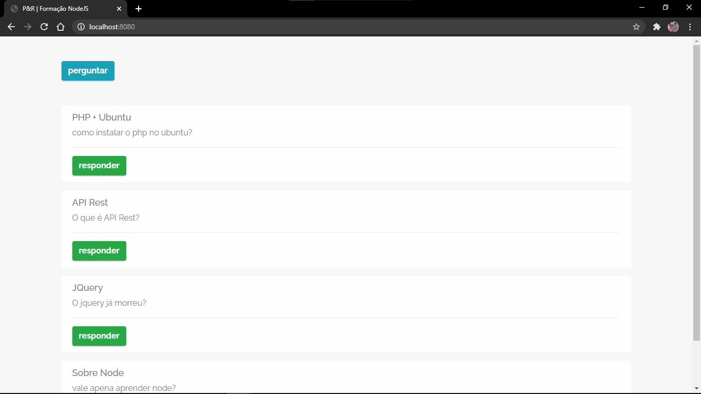
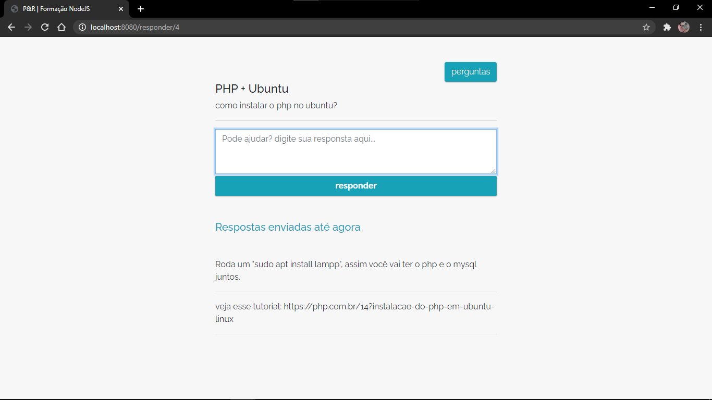
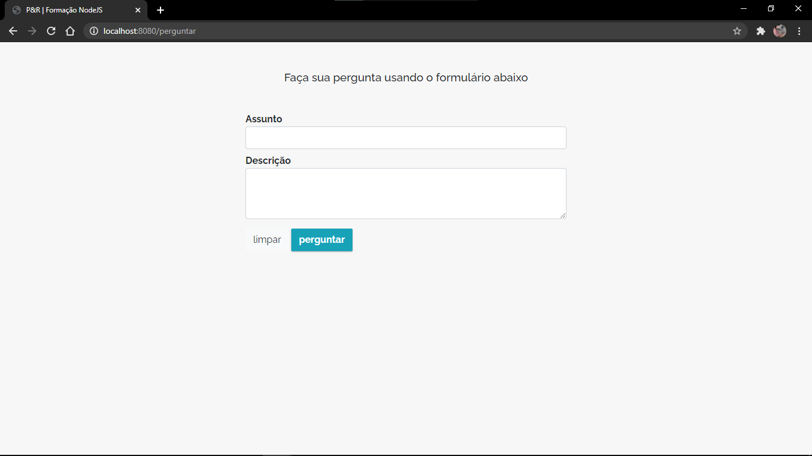

# Plataforma de perguntas e respostas

Projeto da __formação NodeJS__. Esse projeto serve para dar uma base em NodeJS. Apesar de simples, nele é aprendido conceitos muito importantes no desenvolvimento web com __Node__, por exemplo: rotas, views, models, Banco de dados, express, ORM view engine, como trabalhar com assets, formulários e verbos http. Além de mostrar como trabalhar com pacotes da comunidade JS como o `sequelize, ejs, express e mysql2` que são dependências deste projeto.

Enfim, foi dahora demais fazer esse projetinho, abriu a mente \O/

#### Dependências

- [express](https://expressjs.com/pt-br/)
- [sequelize ORM](https://sequelize.org/)
- [mysql2](https://www.npmjs.com/package/mysql2)
- [ejs](https://ejs.co/)

#### Projeto

página __index__ (onde todas as perguntas feitas na plataforma são listadas)

página __pergunta__ (onde se têm mais detalhes de uma pergunta selecionada)

página __perguntar__ (onde é possível fazer uma pergunta na plataforma)

Felipe Oliveira

[Instagram](https://www.instagram.com/felipeoli7eira/)
[LinkedIn](https://www.linkedin.com/in/felipeoli7eira/)